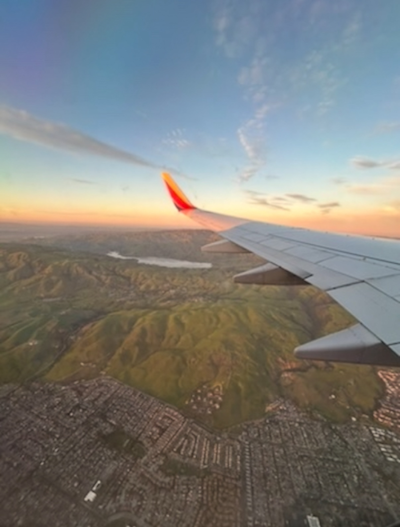
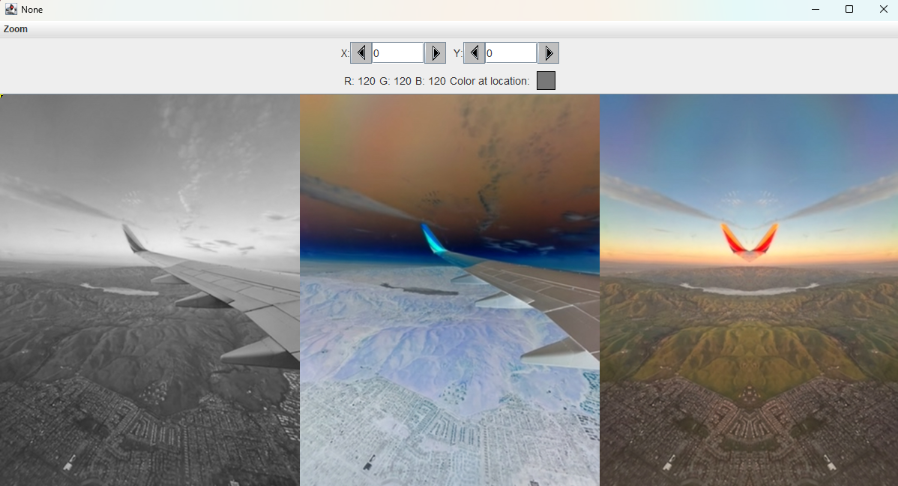

## Image Collage Generator - Java Image Processing Project

- Image Collage Generator is a Java-based image processing application that creates a three-panel collage from a single source image. The program duplicates an image, applies custom visual filters, and combines the results into a single composite canvas. The project emphasizes pixel-level manipulation, nested loop traversal, and modular method design.

### Features
- Image duplication and object copying
- Custom filter application to each image instance
- Vertical or horizontal mirror transformation
- Pixel-by-pixel color manipulation
- Three-panel collage generation
- Automated canvas resizing for layout composition
- Final collage export to image file

### Technical Concepts 
- Object-Oriented Programming (OOP) in Java
- Nested loop traversal of pixel arrays
- Parameterized methods for modular transformations
- Image data structures and pixel indexing
- Encapsulated methods for modifying image objects
- Algorithmic manipulation of digital media

### Technologies Used
- Java
- BlueJ IDE

### Project Structure
- Filter System: Applies visual transformations to duplicated images
- Pixel Processing System: Traverses pixel arrays using nested loops
- Mirror Transformation System: Generates symmetrical image reflections
- Collage Composer: Combines multiple filtered images into a single canvas
- Image Export System: Saves the final collage as a file

### What I Learned
- This project strengthened my ability to work with image data structures and implement algorithmic pixel manipulation in Java. I gained experience designing modular transformation methods, using nested loops for multi-dimensional traversal, and combining processed media into composite outputs.

### Status
- Developed and completed as a demonstration of object-oriented modular software design, image processing, and algorithmic traversal as part of coursework in Java programming.

### Visual Results
- #### Original Image

- #### Filtered Results

